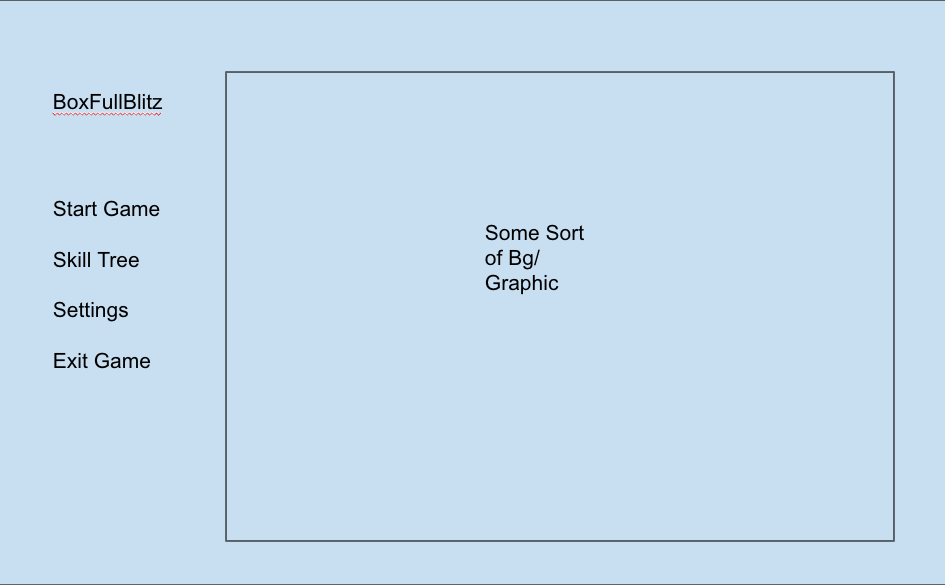
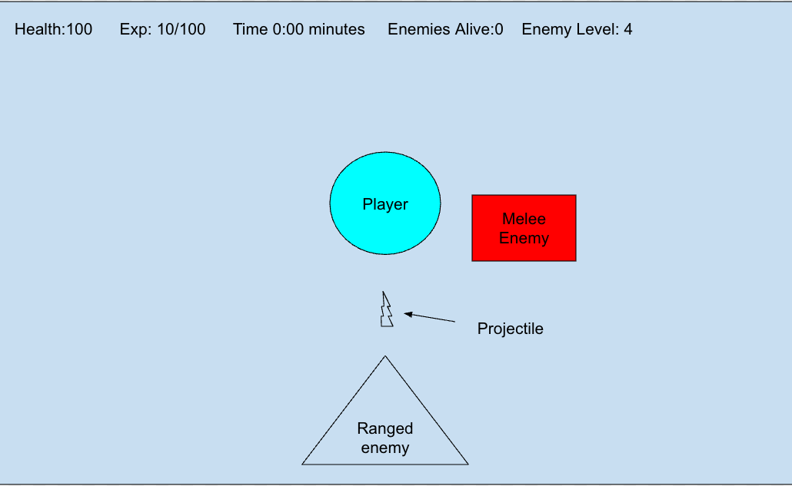

# BoxFull-Blitz
###
* BoxFull-Blitz is a rougelite game. BFB is gonna be OOP, and will use java processing.
* BFB will have graphics within processing
* BFB's main play loop; The player starts on a map whether being a plain background or a "randomly generated scenario bg", this is where different enemies start to spawn and seek out the player; so far there are to types of enemies melee types and ranged types (not including any bosses if i will add that), the player at this point will have one main weapon with another in their inventory that takes time to switch to, the player has health and exp personally, while the "game" has time passed, num of enemies, with them all being displayed on the GUI. 
* Their is no end scenario for BFB, it is a "survival type game", after the player dies they will aquire skill points based off of their time survived, amount of enemies destroyed, powerups, and difficulties
* BFB will use Csv with File Input & Output to manage the players inv, save file, and other things that will need to be saved after closing the game. Csv could also be used for the map/maps usings coords and grid lines
* Will include Enchanced for loops, I & O with Execption handling, Arraylists, GUI

## Class Diagram 

## GUI Mockups

## personal brainstorming / ideas that will be used / to do list
* csv for inventory, stats, map
* enchanced for loop for enemies array 
* include a turn based mode maybe
* I and O with exception handling for csv and save file 
* Bosses within different scenarios that will start at certain times or time intervals
* Figure out the skill tree and projectiles

